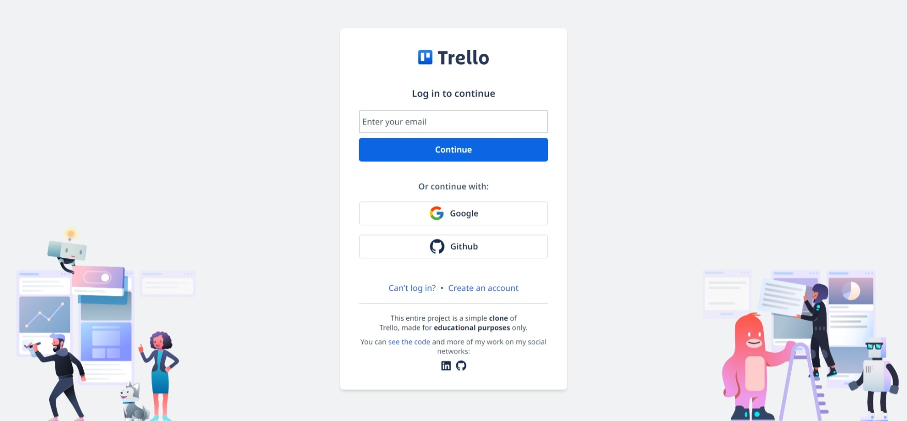
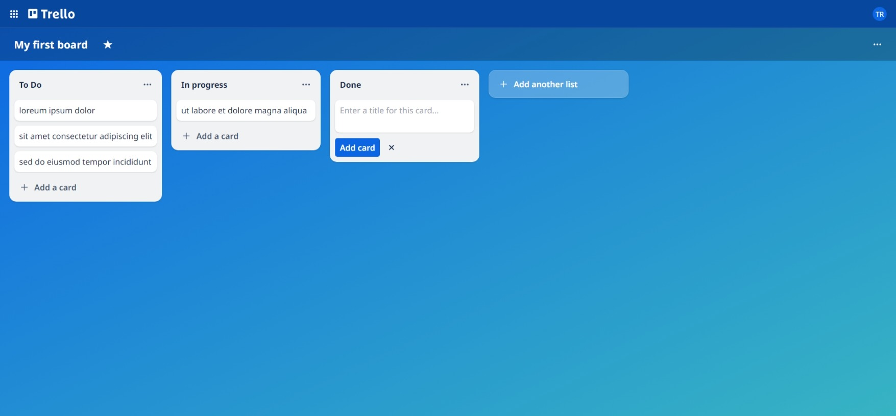
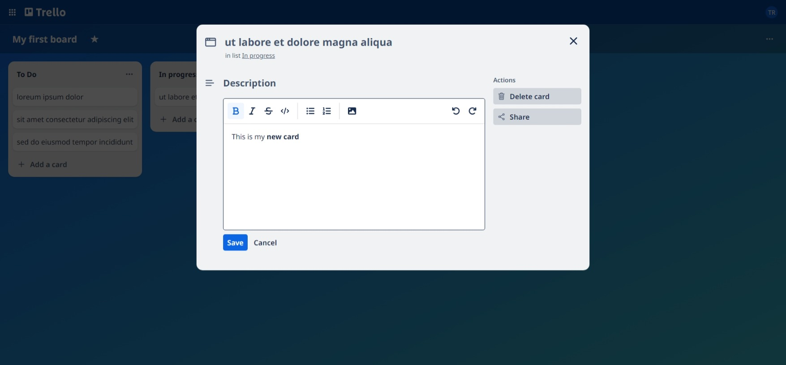

# Trello Clone
This entire project is a clone of Trello, made for educational purposes to test Next.js 14 capabilities

*Next.js, React, Auth.js, Prisma, PostgreSQL, Docker, Tailwind*

#### [Try demo](https://xtrello.vercel.app/) 

## Project preview 🖼️

### Table of contents 📃
- [Trello Clone](#trello-clone)
      - [Try demo](#try-demo)
  - [Project preview 🖼️](#project-preview-️)
    - [Table of contents 📃](#table-of-contents-)
  - [Built with 🛠️](#built-with-️)

## Built with 🛠️

* [Next.js](https://nextjs.org/)
* [React](https://reactjs.org/)
* [Auth.js](https://authjs.dev/)
* [Prisma](https://www.prisma.io/)
* [PostgreSQL](https://www.postgresql.org/)
* [Docker](https://www.docker.com/)
* [React Hook Form](https://react-hook-form.com/)
* [TailwindCSS](https://tailwindcss.com/)
* [Tiptap](https://tiptap.dev/)
* [Framer Motion](https://www.framer.com/motion/reorder/)
  
---
⌨️ with ❤️ by [Juan Pablo Machado](https://github.com/juanpmachadob) 😊 